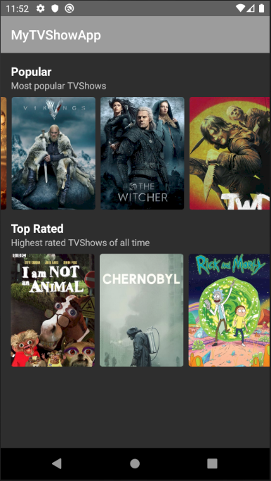
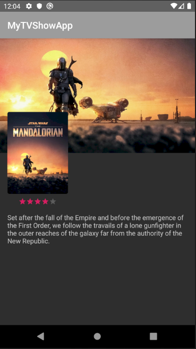

# MyTVShowApp

_Description de l'application :_

MyTVShowApp est une application proposant une liste de séries classées en fonction de leur popularité et de leur note globale. 
L'API utilisé vient du site https://www.themoviedb.org/ , les critères atrribué à chaque séries sont donc ceux attribués par ce site.

On a donc deux listes que l'ont peut scroller horizontalement présentées comme ceci :

Chaque image de série est également cliquable afin d'obtenir plus de détails sur la série en question. On passe alors sur cet écran :

_Expérience personnel :_

Au cours de ce projet j'ai appris à appeler une API afin d'afficher ses données, étape à laquelle j'avais bloqué lors du projet mobile de l'année dernière.
J'ai également appris à gérer la mise à jour des données de l'application si l'utilisateur à une connection internet et le chargement dynamique des données de l'API au moment où l'utilisateur scroll vers la droite.
Enfin j'ai appris à utiliser différentes fonctions Kotlin notament pour les fonctions de rappels.
test update
test test 
encore plus de test
